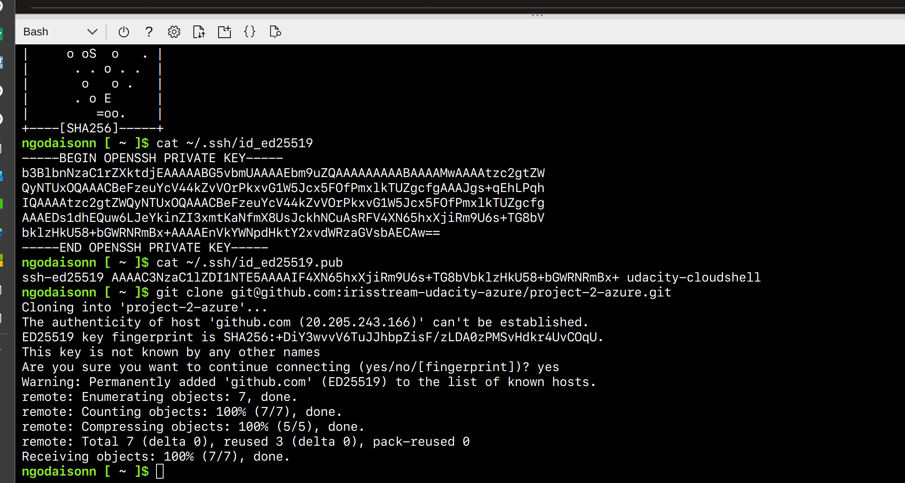

[](https://github.com/IrisStream/project-2-azure/actions/workflows/main.yml)
# Overview

Python-based machine learning application using the Flask web framework. The model will predict housing prices in Boston according to several features, such as average rooms in a home and data about highway access, teacher-to-pupil ratios, and so on.

## Project Plan

* [Trello dashboard](https://trello.com/b/8Tt1zmdW/udacity-azuredevops)
* [spreadsheet](https://docs.google.com/spreadsheets/d/1XFMMsncwQbGezandp_MkGfrga6Fc4ainkcWSCCbG25A/edit?usp=sharing)

## Instructions


* Project running on Azure App Service
``` bash
az webapp up --sku F1 -n <web_app_name>
```


* A screenshot of Azure Azure App Service


* Project cloned into Azure Cloud Shell



* Passing tests that are displayed after running the `make all` command from the `Makefile`


* Output of a test run


* Successful deploy of the project in Azure Pipelines.  [Note the official documentation should be referred to and double checked as you setup CI/CD](https://docs.microsoft.com/en-us/azure/devops/pipelines/ecosystems/python-webapp?view=azure-devops).


* Running Azure App Service from Azure Pipelines automatic deployment


* Locust testing


* Successful prediction from deployed flask app in Azure Cloud Shell.  [Use this file as a template for the deployed prediction](https://github.com/udacity/nd082-Azure-Cloud-DevOps-Starter-Code/blob/master/C2-AgileDevelopmentwithAzure/project/starter_files/flask-sklearn/make_predict_azure_app.sh).
The output should look similar to this:


* Output of streamed log files from deployed application

 

## Enhancements

* Add more test to CI pipeline
* Build infrastructure using IaC
* Apply Blue-green deployment

## Demo 

[Youtube link](https://www.youtube.com/watch?v=0EVQ4y_59GU